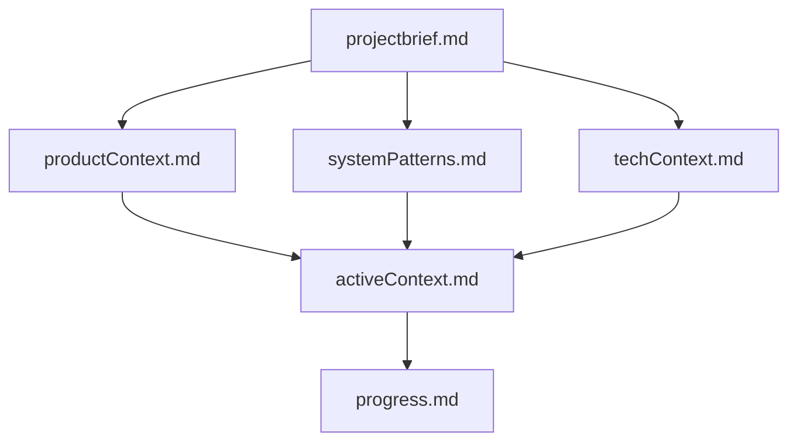

# Memory Bank - Eren Atasoy Portfolio Website

## Purpose

This memory bank serves as the complete context and documentation for the portfolio website project. It enables anyone (including AI assistants after memory resets) to quickly understand the project's current state, architecture, and next steps.

## Structure

### Core Files (Always Read These)

1. **[projectbrief.md](./projectbrief.md)** - Start Here

   - Project overview and goals
   - Target audience
   - Success criteria
   - Core requirements
   - Future enhancements

2. **[productContext.md](./productContext.md)** - Why This Exists

   - Problem statement
   - User personas
   - User experience goals
   - Product principles
   - Competitive analysis

3. **[systemPatterns.md](./systemPatterns.md)** - How It's Built

   - System architecture
   - Component hierarchy
   - Design patterns used
   - Data flow
   - Code organization

4. **[techContext.md](./techContext.md)** - Technologies Used

   - Tech stack details
   - API integrations
   - Development environment
   - Deployment process
   - Dependencies

5. **[activeContext.md](./activeContext.md)** - Current Focus

   - Recent changes
   - Active decisions
   - Known issues
   - Next steps
   - Open questions

6. **[progress.md](./progress.md)** - Status Report
   - What works
   - What's left to build
   - Quality metrics
   - Timeline

## How to Use This Memory Bank

### For New Team Members

1. Read `projectbrief.md` to understand what we're building
2. Read `productContext.md` to understand why
3. Read `techContext.md` to understand the tech stack
4. Read `systemPatterns.md` to understand the architecture
5. Read `activeContext.md` to see what's happening now
6. Read `progress.md` to see what's done and what's next

### For AI Assistants (After Memory Reset)

1. **ALWAYS** read ALL memory bank files at the start of ANY task
2. Focus especially on `activeContext.md` for current state
3. Check `progress.md` for completed vs pending work
4. Reference `systemPatterns.md` when making technical decisions
5. Update `activeContext.md` after significant changes

### For Quick Reference

- **Current status?** → Read `progress.md`
- **What to work on next?** → Read `activeContext.md`
- **How does X work?** → Read `systemPatterns.md`
- **What tech do we use?** → Read `techContext.md`
- **Why did we build this?** → Read `productContext.md`
- **What's the big picture?** → Read `projectbrief.md`

## Maintenance

### When to Update

**activeContext.md** - Update after:

- Significant feature additions
- Architecture changes
- New decisions made
- When user says "update memory bank"

**progress.md** - Update after:

- Completing major features
- Reaching milestones
- Starting new phases
- Weekly progress reviews

**Other files** - Update when:

- Core requirements change (projectbrief.md)
- Target audience shifts (productContext.md)
- Architecture evolves (systemPatterns.md)
- Tech stack changes (techContext.md)

### How to Update

1. Read current file
2. Add new information (don't remove old unless wrong)
3. Update "Last Updated" dates
4. Keep information accurate and current
5. Use clear, concise language

## File Relationships

## Quick Facts

### Project Status

- **Phase**: Production Ready (v1.0)
- **Deployment**: Live on Vercel
- **Completion**: ~95%
- **Last Updated**: October 26, 2025

### Key Technologies

- **Frontend**: React 18 (JavaScript)
- **Styling**: Tailwind CSS
- **Deployment**: Vercel
- **APIs**: GitHub, Medium RSS, Web3Forms

### Core Features

✅ Hero with 3D effects  
✅ About with skills grid  
✅ Projects from GitHub  
✅ Blog from Medium  
✅ Contact form  
✅ Dark mode  
✅ Responsive design

### Next Actions

1. Test Web3Forms integration
2. Final QA testing
3. Deploy to production
4. Add analytics

## Important Links

### External Resources

- [GitHub Repository](https://github.com/Eren-Atasoy/personal-website)
- [Vercel Dashboard](https://vercel.com)
- [Web3Forms](https://web3forms.com)
- [GitHub API Docs](https://docs.github.com/en/rest)

### Internal Documentation

- [Contact Form Setup](../CONTACT_FORM_SETUP.md)
- [Main README](../README.md)
- [env.example](../env.example)

## Notes

### Best Practices

- Keep documentation updated
- Be specific and detailed
- Include examples and code snippets
- Cross-reference between files
- Use clear section headers

### Version Control

- Memory bank files are tracked in Git
- Update atomically (don't leave half-done)
- Use meaningful commit messages
- Review before committing

### Communication

- Use present tense for current state
- Use past tense for completed work
- Use future/todo for planned work
- Be objective, not promotional

## Questions?

If something is unclear or missing:

1. Check other memory bank files
2. Look at actual code files
3. Check Git commit history
4. Ask the team
5. Update documentation once clarified

---

**Remember**: The memory bank is only useful if kept updated. Every significant change should be reflected here.
